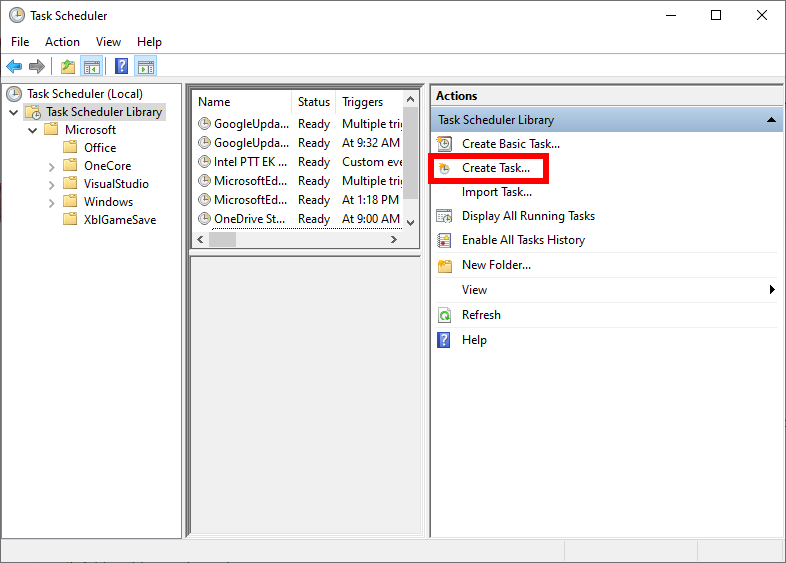
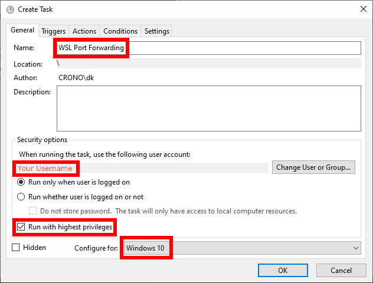
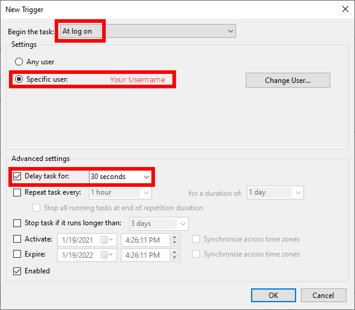
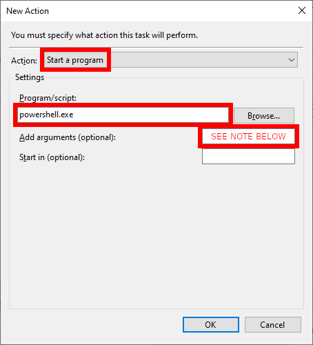

OLA on Windows
==============

OLA is not presently available directly on Windows. However, it can be used with a shim. Note these
installations are not well-tested and may encounter problems. In particular, non-network plugins (e.g. USB DMX) will
fail to function. For show-critical uses, consider using a Linux system, such as a [Raspberry Pi](ola_on_raspberry_pi).

Windows Subsystem for Linux (WSL) allows running programs written for Linux (such as OLA) on Windows. WSL requires
recent versions of Windows 10.

Setup
=====

1. Begin by installing WSL using the
   [installation instructions](https://docs.microsoft.com/en-us/windows/wsl/install-win10). Be sure to follow the
   instructions for WSL2, not WSL1
2. WSL supports several distributions, but OLA is best supported with Debian. Install the
   [Debian WSL distribution](https://www.microsoft.com/en-us/p/debian/9msvkqc78pk6) from the Microsoft Store.
3. From the Start Menu, launch Debian. Create a UNIX username and password when prompted.
4. Once the system is installed, run `sudo apt-get update` and `sudo apt-get upgrade` to keep the system updated.
5. Install OLA with `sudo apt-get install ola`.

Networking
==========

TODO: This doesn't forward UDP ports, a function required for nearly everything interesting you can do with OLA.

WSL uses a virtual network adapter internally. This means connections to OLA from your LAN will initially fail. There is
some work being done in this area [here](https://github.com/microsoft/WSL/issues/4150). The following instructions are
adapted from a [workaround](https://github.com/microsoft/WSL/issues/4150#issuecomment-504209723) in that issue.

Create a PowerShell script somewhere on your system with these contents:

    $remoteport = wsl -d Debian ip addr `| grep -Ee 'inet.*eth0'
    $found = $remoteport -match '\d{1,3}\.\d{1,3}\.\d{1,3}\.\d{1,3}';
    
    if( $found ){
      $remoteport = $matches[0];
    } else{
      Write-Output "The Script Exited, the ip address of WSL 2 cannot be found";
      exit;
    }
    
    #[Ports]
    
    #All the ports you want to forward separated by comma
    $ports=@(9090);
    
    
    #[Static ip]
    #You can change the addr to your ip config to listen to a specific address
    $addr='0.0.0.0';
    $ports_a = $ports -join ",";
    
    
    #Remove Firewall Exception Rules
    Invoke-Expression "Remove-NetFireWallRule -DisplayName 'WSL 2 Firewall Unlock (TCP)'";
    Invoke-Expression "Remove-NetFireWallRule -DisplayName 'WSL 2 Firewall Unlock (UDP)'";
    
    #adding Exception Rules for inbound and outbound Rules
    Invoke-Expression "New-NetFireWallRule -DisplayName 'WSL 2 Firewall Unlock (TCP)' -Direction Outbound -LocalPort $ports_a -Action Allow -Protocol TCP";
    Invoke-Expression "New-NetFireWallRule -DisplayName 'WSL 2 Firewall Unlock (UDP)' -Direction Outbound -LocalPort $ports_a -Action Allow -Protocol UDP";
    Invoke-Expression "New-NetFireWallRule -DisplayName 'WSL 2 Firewall Unlock (TCP)' -Direction Inbound -LocalPort $ports_a -Action Allow -Protocol TCP";
    Invoke-Expression "New-NetFireWallRule -DisplayName 'WSL 2 Firewall Unlock (UDP)' -Direction Inbound -LocalPort $ports_a -Action Allow -Protocol UDP";
    
    for( $i = 0; $i -lt $ports.length; $i++ ){
      $port = $ports[$i];
      Invoke-Expression "netsh interface portproxy delete v4tov4 listenport=$port listenaddress=$addr";
      Invoke-Expression "netsh interface portproxy add v4tov4 listenport=$port listenaddress=$addr connectport=$port connectaddress=$remoteport";
    }

Add additional ports, if needed, separated by a comma below `#ADD PORTS HERE`.

Next, open the Task Scheduler. Create a new task:

Configure the task like so:

In the triggers tab, add a new trigger:

In the actions tab, add a new action:

The arguments should be:

    -ExecutionPolicy Bypass <PATH TO YOUR SCRIPT> 

Save the action, then select it and choose `Run` from the right sidebar.

Here are some common standard ports:

| Plugin            | Port       |
|-------------------|------------|
| OLA Web interface | 9090       |
| ArtNet            | 6454       |
| E1.31 (sACN)      | 5568-5569  |
| Enttec ESP Net    | 3333       |
| KiNet             | 6038       |
| Pathport          | 3792       |
| Strand ShowNet    | 2501       |

Start/Stop OLA
==============

When you wish to use OLA, open Debian from the Start Menu and run:

    sudo service rsyslog start
    sudo service dbus start
    sudo service olad start

OLA will continue to run in the background, regardless of whether the Debian command prompt is open or not.

To stop, run:

    sudo service olad stop
