OLA inside VirtualBox
=====================

These instructions explain how to install OLA inside a virtual machine.

Downloads
=========

Download VirtualBox from [here](https://www.virtualbox.org/wiki/Downloads).

Also download the latest Debian release from [here](https://www.debian.org/distrib/netinst).

Setup Virtual Machine
=====================

Open VirtualBox and choose Machine > New. On the first screen, enter a name for your virtual machine and choose Debian
Linux. The remainder of the defaults are fine.

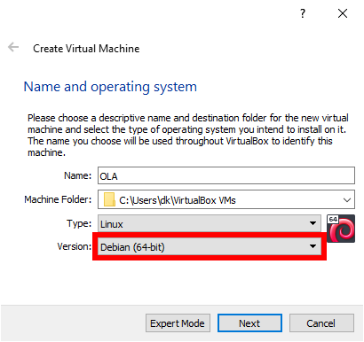

Once your machine is created, select it in the sidebar and choose Settings. Select Network from the sidebar and set it
to "Bridged Adapter".

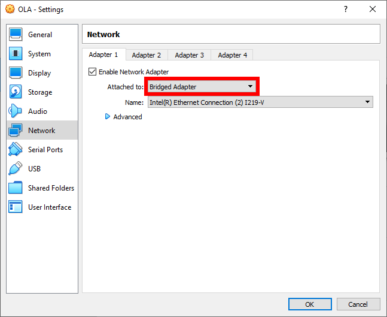

Now click Start. A "Select start-up disk" window will appear, as the machine is not initialized. Click the folder icon,
then Add, then browse to your download Debian ISO file. The Debian installer will begin.

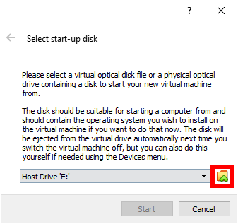

Press enter on "Graphical install"

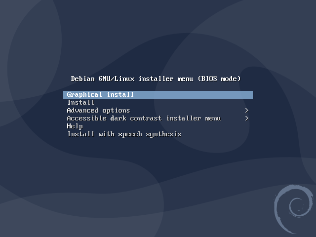

The installer will ask you about your language, location, and keyboard.

When asked for a hostname, choose something sensible. Leave the domain name empty unless you already know you need to
put something there.

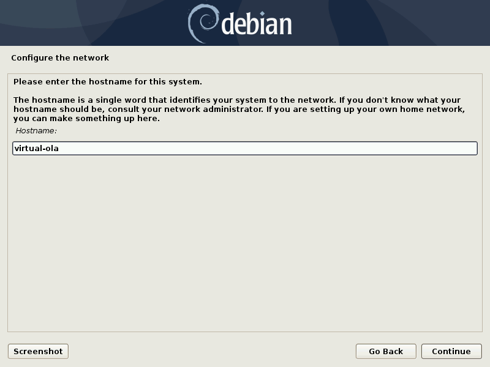

Set a root and user password you will remember. You'll need them later.

Configure the clock to your local time zone.

Continue to select the default options. When asked "Write the changes to disks?" select "Yes" and Continue.

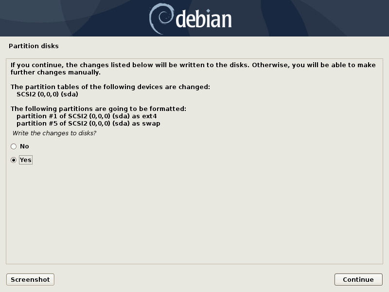

Debian will take a bit to install. Eventually you'll be asked to scan additional CD/DVDs. There are none, so accept the
defaults, entering a proxy if your network requires one.

When the Software selection menu appears, select only "SSH server" and "standard system utilities".

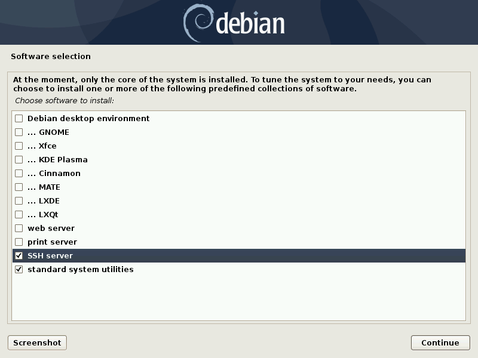

The software will install. Choose to install the GRUB boot loader to the master boot record. Select the only disk
available.

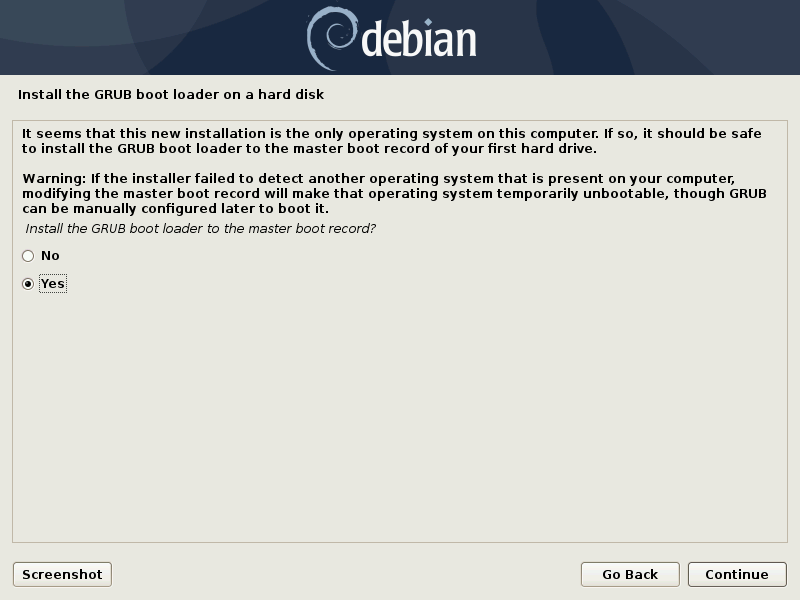

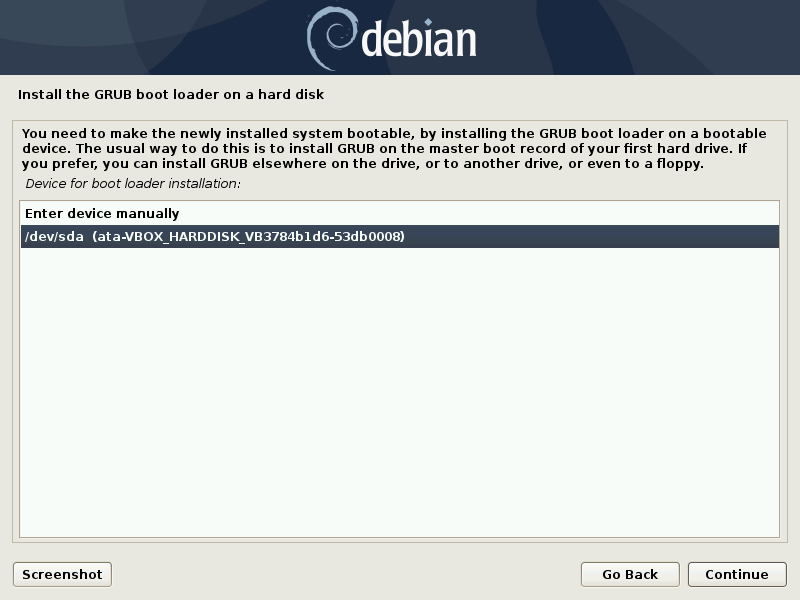

When installation is complete, choose continue. The system will reboot. When the screen looks like below, it's ready:

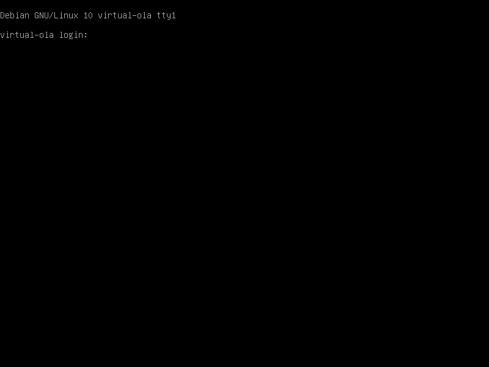

Installation
============

Type your username from earlier in the setup process, followed by Enter. Then type your password (it won't be visible as
you type), followed by Enter.

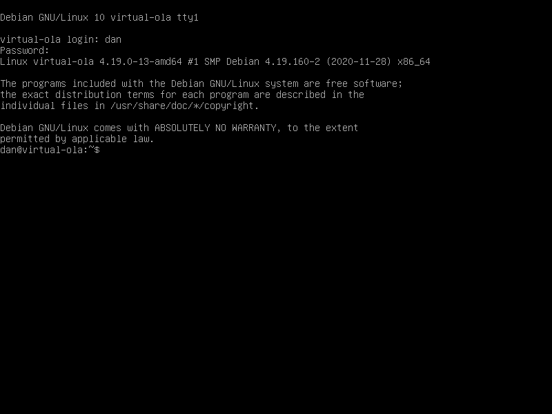

Enter the following commands

    su
    apt-get update
    apt-get install ola

Type `Y` to continue. Then run `/sbin/reboot` to reboot the machine.

Log in again once the machine is rebooted. Find the system's IP address with `ip addr`. An example of the output with
the address highlighted is below:

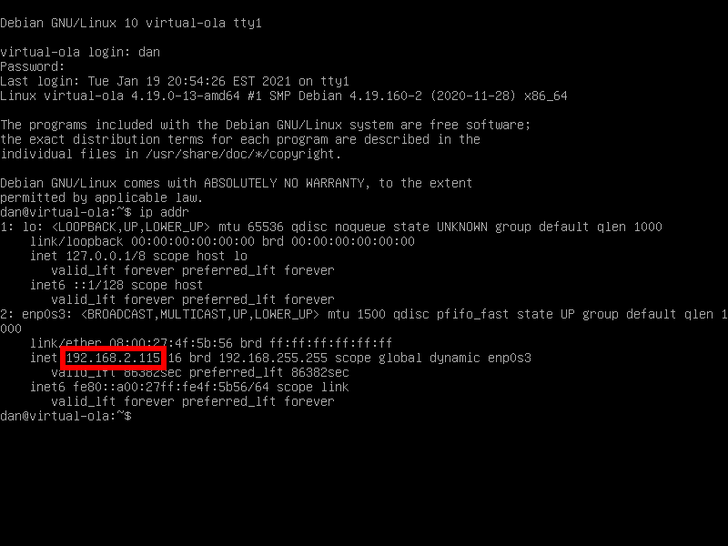

Visit `https://<ip_address>:9090` in a browser for OLA's web interface.

Shutdown
========

To shutdown the system, use the VirtualBox window: Machine > ACPI Shutdown.

Troubleshooting
===============

No plugins
----------

If your system is too nice, OLA may start before the network is available. You'll know this has happened when the
"Primary IP" is `0.0.0.0` and very few plugins are available:

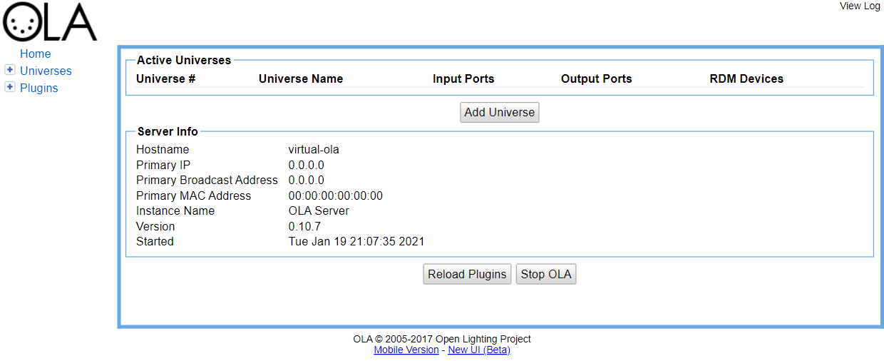

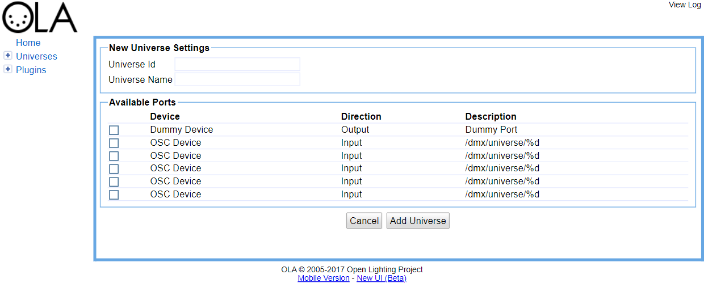

There is a simple fix. Log in and run:

    su
    systemctl restart olad

Refresh the web interface. A real IP address should be listed and plugins should be available.
